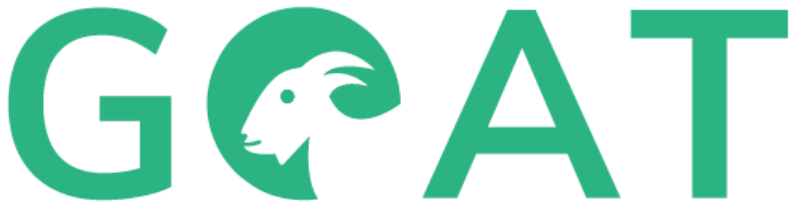

    

 

## About

This is the homebase of Geo Open Accessibility Tool (GOAT). GOAT is meant to be an open source, interactive,
flexible and useful web-tool for accessibility planning. Currenty the tool is maintained by the Startup [Plan4Better](https://plan4better.de) and the [Technical University of Munich (TUM)](https://www.bgu.tum.de/en/sv/homepage/). 

For more information:

[GOAT Docs](https://plan4better.de/docs/background/)

[GOAT demo versions](https://plan4better.de/goatlive/)

[Join GOAT User Group on Telegram](https://t.me/joinchat/EpAk7BYbIF72q7D3OTUCZQ)

[Follow GOAT on LinkedIn](https://www.linkedin.com/company/plan4better)

[Follow GOAT on Twitter](https://twitter.com/plan4better)
