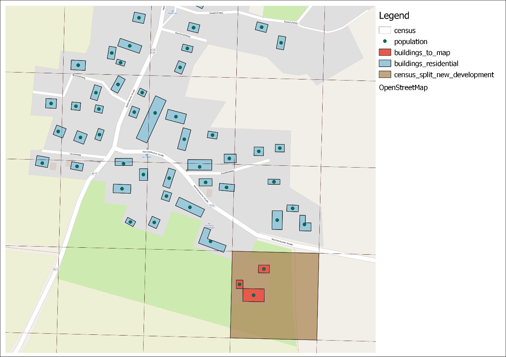

#### 1. Residential buildings

buildings_residential.sql

This script identifies all residential buildings at a specified location based on land use and building data. For this are all attributes of the buildings used. 

Filters can be adjusted to the local OSM-dataset. The default values are coming from the Munich Region. You can adjust following filters: 

- <b>custom_landuse_no_residents</b>: if you have a custom landuse-layer you can define landuse categories that are not residential
- <b>osm_landuse_no_residents</b>: osm-tag landuse that is not for residents, this filter is combined in case you have custom landuse data
- <b>building_types_potentially_residential</b>: osm-tag building that should not be excluded – Note: many buildings are just called building=yes
- <b>building_types_residential</b>: osm-tag building that are for sure residential e.g. building=residential (For more information visit [https://wiki.openstreetmap.org/wiki/Key:building](https://wiki.openstreetmap.org/wiki/Key:building))
- <b>tourism_no_residents</b>: osm-tag tourism that has no residents (For more information vist [https://wiki.openstreetmap.org/wiki/Tourism](https://wiki.openstreetmap.org/wiki/Tourism) )
- <b>amenity_no_residents</b>: osm-tag amenity that has no residents (For more information visit [https://wiki.openstreetmap.org/wiki/Key:amenity](https://wiki.openstreetmap.org/wiki/Key:amenity))
- <b>minimum_building_size_residential</b>: all buildings that have a smaller size than this are excluded (very often garages etc.)

the script furthermore extracts building levels for the residential buildings, in case no building levels are in the osm-attributes (unfortunately this is usually the case) you can adjust a default value for the building levels in the `variable_container`.

<b>Note these building levels are used for the Census extrapolation or the population disaggregation<b>

buildings_residential: after the scripts has finished it will create a table called - residential buildings. It should contain only residential buildings. But as always the accuracy very much depends on the data quality.
<td>  </td>

#### 2. Census extrapolation
<b>Custom data<b>

census.shp

landuse.shp (optional)

fixed_population.shp (optional)

In the case you have census data in your study area but you know the data is outdated. GOATbeta has an script `your-GOAT-directory/app/data_preparation/SQL/census.sql` that allows you to update the census grids based on current population numbers in your whole study area, , which you provided in the layertable `study_area`. A prerequisite is that your population numbers for your `study_area` more recent, than your census data. Currently the script does only work if the population numbers have increased in the timespan that is lying between the reference year of the census data and the reference year of the administrative boundaries of your `study_area`. 

The script checks for areas where new development took place and estimates based on average gross living area how many residents live in the affected grids. You can also customize the same in the `variable_container`. This procedure also makes use of the extracted residential buildings as described in `your-GOAT-directory\app\data_preparation\SQL\buildings_residential.sql`

This script is designed in a way that allows to iteratively improve the results. It is recommended to simply run the setup of GOAT and check for the quality of the population data. There will be following tables if the script was running successfully:  
- buildings_to_map all buildings of buildings_residential that are located within a grid cell in which no population from the census is documented. This means that the scripts assumes that these buildings were built after the census and should be reviewed if they are mapped correctly. The building type, building levels and land use of the area are of particular importance. It is recommended to map this information directly in the OSM database (create a link to the other page about mapping). When updating GOAT you can get your most recent changes in OpenStreetMap.  
- population calculated population of a building unit (if there are several address points or entrances  on one building, the building area is equally distributed to the units), based on the living area resulting from the building level, roof levels and the number of residential levels. In grid cells with a documented population, the census population data is distributed proportionally among the building units. For grid cells for which no population was recorded in the census, the additional population moved between the census and now into the `study_area` (calculated from the difference between the census data and the up to date population data stored in the table study_area), is distributed proportionally among all new residential building units. Negative population data means there is no population ascertained in this building. 
- census_split_new_developmentall grid cells where new residential development took place. 

As this script is following simplistic rules and assigns new population to places based on the building volume (area x number of floors) it happens that there are assign very high population numbers to big buildings. Often this is correct, however in case of e.g. Villas in the forest this could be wrong. Therefore, you have the possibility to upload a layer where you are able to fix the population numbers for certain buildings. You can simply create a shapefile with the structure mentioned here https://www.open-accessibility.org/docs/data_preparation/ your-GOAT-directory/app/database/data/fixed_populatipon.shp

The script delivers the following output:
<td>  </td>