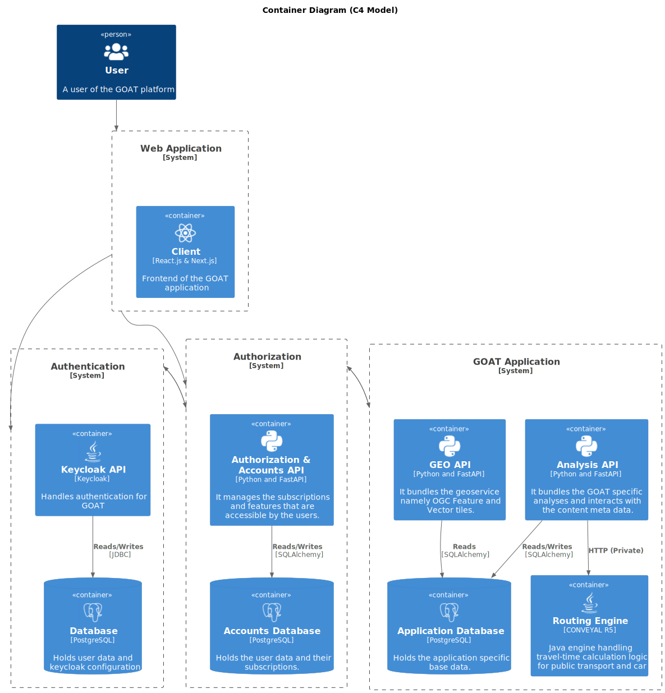

# Software Architecture

The backend of GOAT is making use of a Microservice architecture that is built using a diverse tech stack. The Backend of the GOAT platform is built using the following core technologies:

- [Python](https://www.python.org/)
- [PostgreSQL](https://www.postgresql.org/)
- [PostGIS](https://postgis.net/)
- [FastAPI](https://fastapi.tiangolo.com/)
- [Keycloak](https://www.keycloak.org/)

The following diagram shows the architecture of the GOAT backend:

### Authentication
Keycloak is a reliable open source Identity and Access Management solution that is used to manage users and groups. Its powerful features also enable easy identification of users. To ensure seamless integration with the system container, Keycloak is managed in a separate container, connected via a private network. The Keycloak data is saved in a PostgreSQL Database. 

### Authorization 
The GOAT backend is comprised of several containers, with the authorization container serving as the central communication hub. The authorization API is written in Python using FastAPI. It is responsible for managing all incoming requests from the frontend, communicating with other containers as necessary. Though authentication is handled in the authentication layer, within the authorization system lies the authorization mechanism. This involves verifying that a user possesses proper permissions and subscriptions (in SaaS installations) before granting access to the requested action. All related data is stored in a PostgreSQL database, accessed through SQLAlchemy.

### Application
The application system is built around an API that has been implemented using Python's FastAPI framework. This API is responsible for serving the business logic of the GOAT platform and is contained within a containerized environment. The container can interact with both the application database and the organization database to retrieve base data as well as specific user-related information. Additionally, the API leverages the r5 engine to perform travel time calculations and can read static files from the file system.

