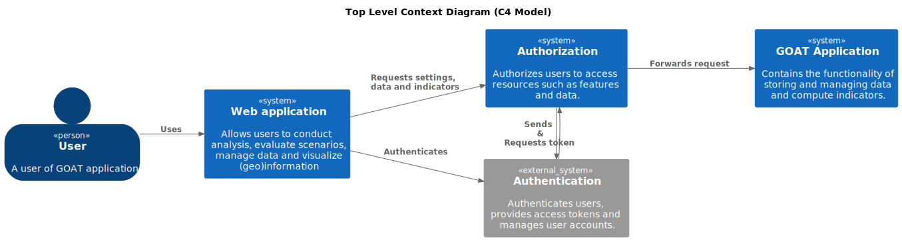

# Software Architecture

The backend of GOAT is making use of a Microservice architecture that is built using a diverse tech stack. The Backend of the GOAT platform is built using the following core technologies:

- [Python](https://www.python.org/)
- [PostgreSQL](https://www.postgresql.org/)
- [PostGIS](https://postgis.net/)
- [FastAPI](https://fastapi.tiangolo.com/)
- [Keycloak](https://www.keycloak.org/)
- [R5](https://github.com/conveyal/r5)

To describe the software architecture the [C4 Model](https://c4model.com/) is used. The C4 Model is a hierarchical model that describes the software architecture on four different levels. The following sections will describe level 1 and level 2 of the C4 Model, which are context and containers.

## Contexts

#### Web application
The client represents the application's user interface, comprising both a map view and a dashboard view. The dashboard serves multiple functions; it facilitates user account management, project creation, and oversees data management. In contrast, the map view is geared towards project execution, performance of analyses, and visualization and export of results, enabling users to interactively engage with their data.

#### Authentication
The authentication system is responsible for managing users, organizations and groups. It is used to authenticate users and check their roles. 

#### Authorization
The authorization system takes charge of supervising permissions and subscriptions. Its principal function involves verifying whether a user possesses the requisite permissions to undertake a specific action, thereby maintaining a robust control over application access and user activities.

#### GOAT Application
The GOAT application forms the heart of the GOAT platform. Its role includes managing projects, conducting analyses, and generating results. In addition to these duties, the application also performs analyses and accurately delivers the related data, making it a complete solution for data processing and interpretation.

## Containers

The following container diagram is a high-level overview of the different services used in GOAT. The containers are described in more detail in the following sections.

### Web application 

#### React

#### Next.js 

### Authentication
Keycloak is an open-source solution, used for managing users and groups as well as organizations, with the help of the PhaseTwo extension. This tool identifies users and knows their roles, organization and groups they belong too. Keycloak-related data, including those related to organizations, is stored in a PostgreSQL Database.

#### Keycloak API
The Keycloak API is a REST API that is used to manage users, groups and organizations. The web application is directly interacting with the API to authenticate users. 

#### Keycloak Database
THe Keycloak Database is a PostgreSQL Database that is used to store the Keycloak data. It is managed by the Keycloak system and we are not directly interacting with it. 

### Authorization 
The GOAT backend is comprised of several containers, with the authorization container serving as the central communication hub. The authorization API is written in Python using FastAPI. It is responsible for managing all incoming requests from the frontend, communicating with other containers as necessary. Though authentication is handled in the authentication layer, within the authorization system lies the authorization mechanism. This involves verifying that a user possesses proper permissions and subscriptions (in SaaS installations) before granting access to the requested action. All related data is stored in a PostgreSQL database, accessed through SQLAlchemy.

#### Authorization and Accounts API

This is a REST API, crafted in Python using FastAPI. The API possesses dual functionalities. Its primary role is to authenticate users by validating their permissions, subscriptions, and roles, effectively functioning as an API gateway. This feature is crucial for protecting the GOAT application API from unauthorized access. Upon successful authorization of a user for a requested service, the API forwards the request to the GOAT API.

Secondly, this API provides access to both user and organization data, managing the distribution of content among various groups. It directly interacts with the accounts database, employing SQLAlchemy to extract the necessary data.
In addition to this, the API communicates with the Keycloak API, facilitated by a library known as 'python-keycloak'. This interaction negates the need for direct API access. Upon receiving the user token, it is used to retrieve user details and verify their roles.

#### Authorization and Accounts Database

We utilize a PostgreSQL database to store detailed user, organization, and group data, which falls beyond the scope of Keycloak. This database also holds references to content uploaded through the GOAT application, tracking its sharing across various groups. Furthermore, it carefully manages user subscriptions and the linked regions, delineating the geographical boundaries for each subscription.

### GOAT Application

#### GOAT API 
The GOAT API, developed using Python and FastAPI, serves as the central core of the application. It takes on the critical tasks of managing projects, performing analyses, and generating results. The API maintains direct interaction with the GOAT database, and is furnished with a variety of built-in algorithms. Additionally, it utilizes the R5 Engine for conducting travel time analyses and computing diverse indicators. It also facilitates the distribution of spatial data, providing it in a wide range of formats, types, and resolutions to cater to different needs.

#### GOAT Database

The GOAT database is a comprehensive PostgreSQL database, equipped with the PostGIS extension. It encompasses all the fundamental components necessary to operate GOAT, such as network configurations, opportunity data sets, base settings, and more. Consequently, the database holds a wide array of both spatial and non-spatial data, catering to the diverse needs of the GOAT system.

#### Organization Database

Database for the organization data. Each organization is receiving it own database to clearly seperate the data of the different organizations. It is used to store the custom data of the organization or users of the organization. And it is used store the data that is produced using the GOAT application. 

#### R5 Engine

The R5 Engine, crafted in Java, functions as a versatile routing mechanism employed to conduct intermodal travel time analyses for cars and public transport. This engine is harnessed by the GOAT API to perform sophisticated travel time analyses, reinforcing the application's efficiency and functionality.
